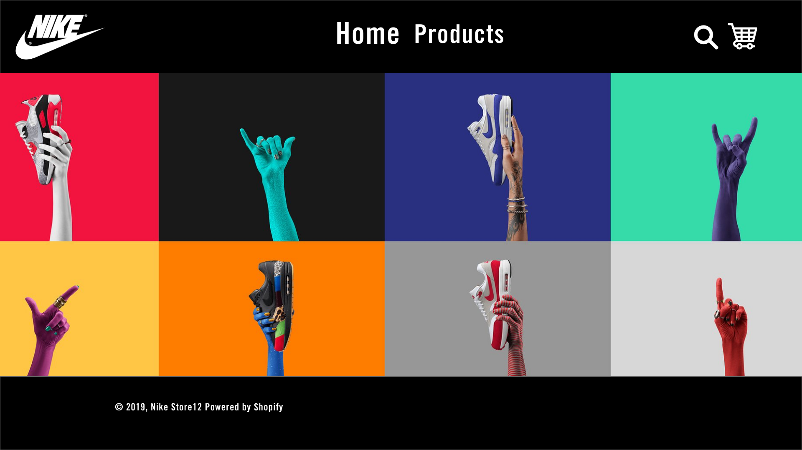
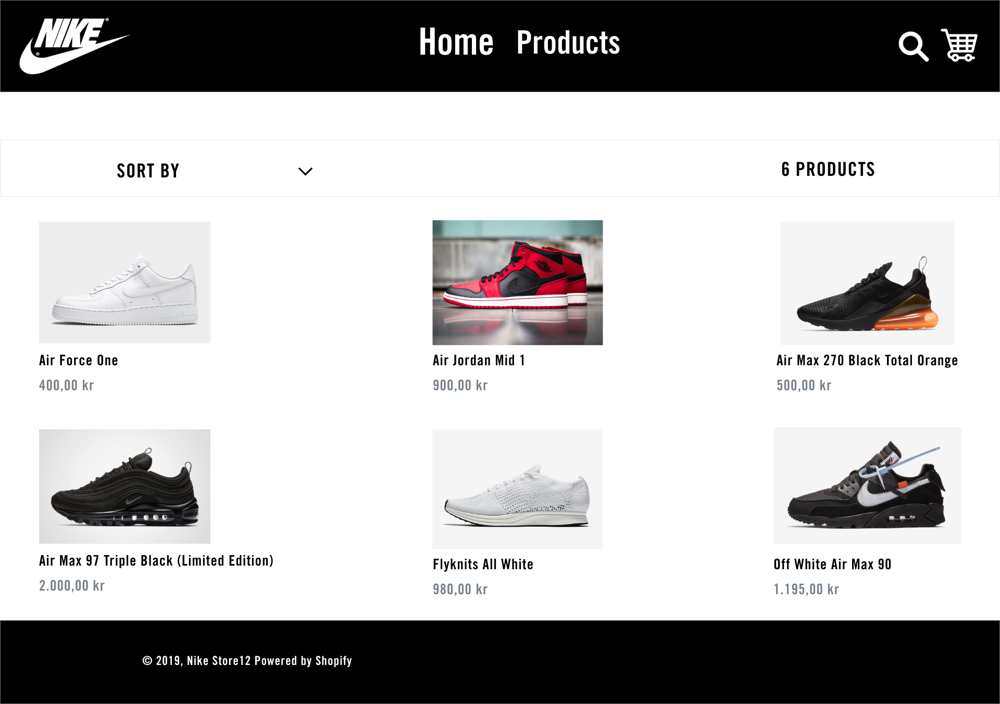
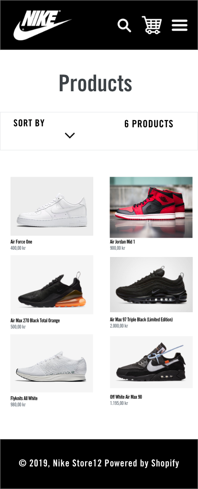
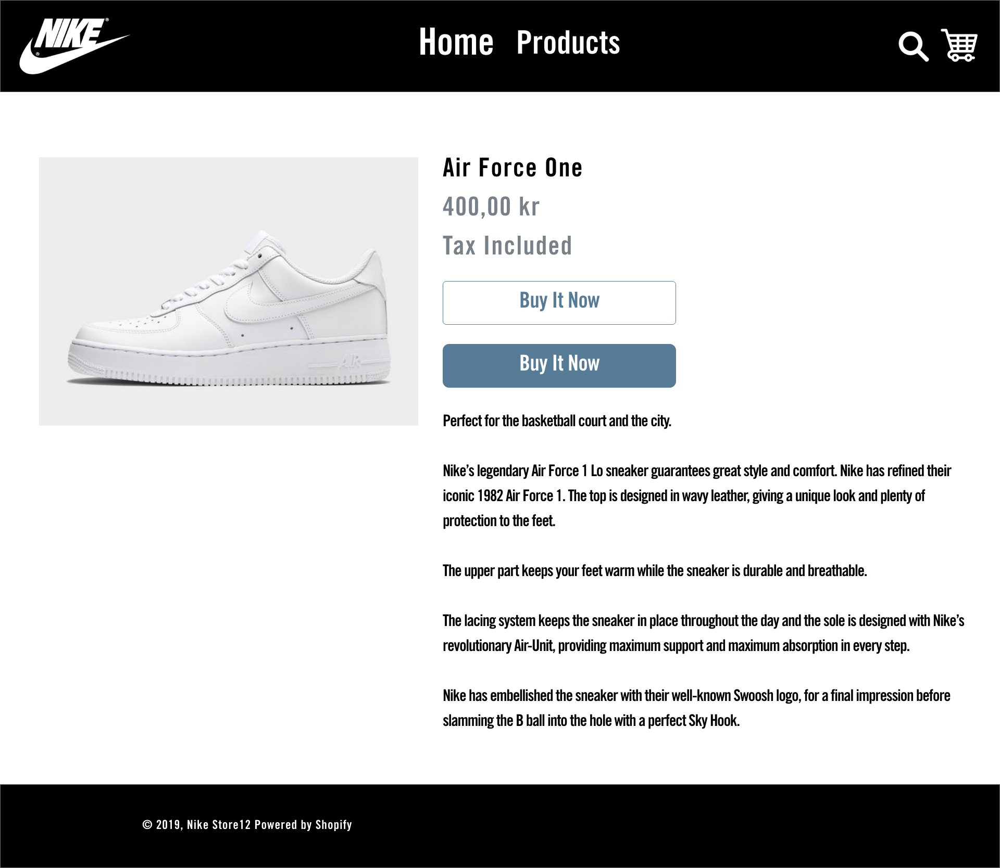
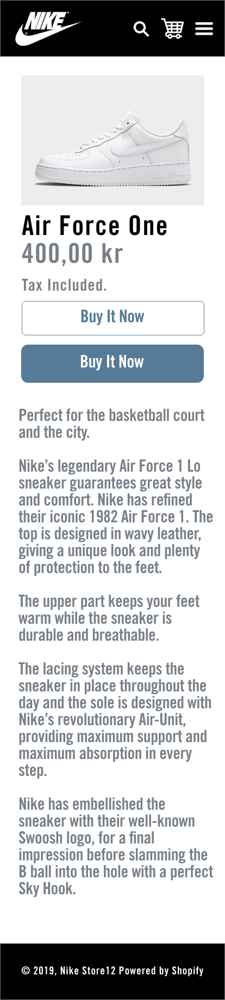
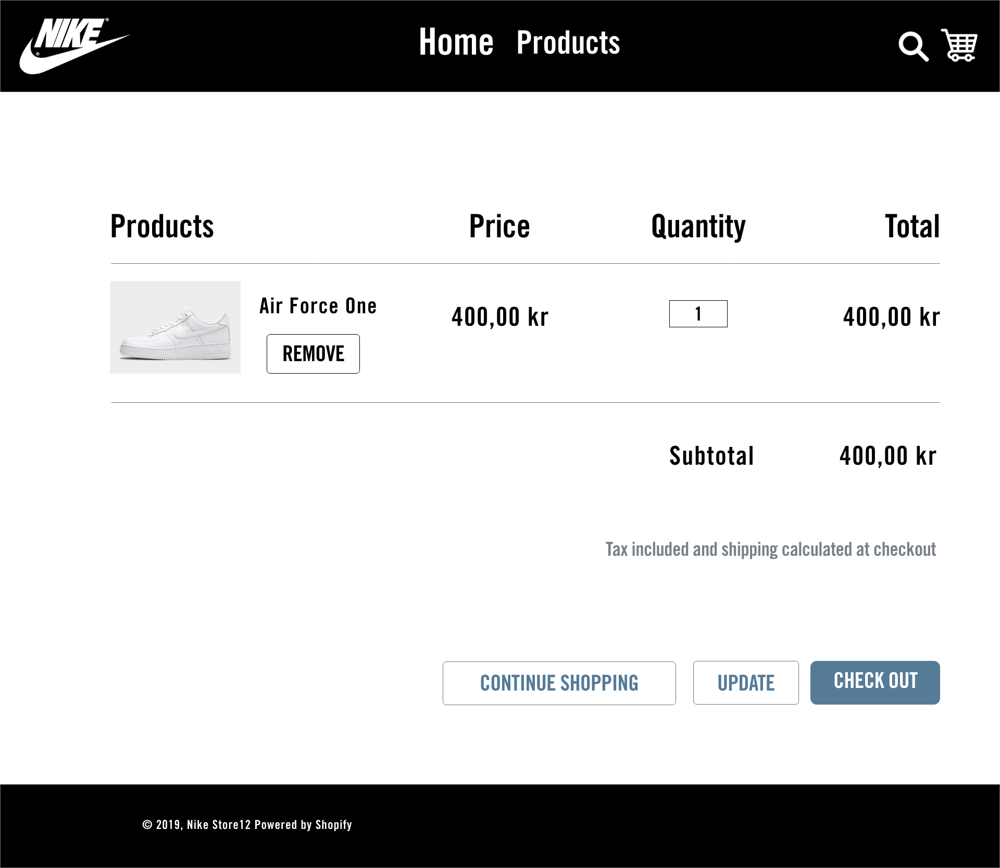
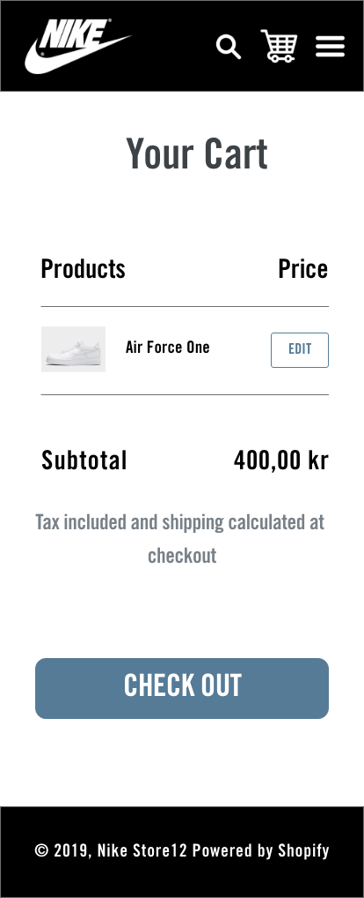

# Nike-Store

1. The problem that I had to overcome was to try to find where all the different parts of the code was in the projects, because all the files were scattered around. By overcoming that I stuck to 2 main folders which were the assets which keeps all my stylesheets and js files and the sections folder which contains all the different parts of html broken down into separate files.

2. Navigation of how to use Shopify, since it's first time I used it, it took some time for me to get used to it so I watch some tutorials and just did it by trial and error making some mistakes and correcting them by clicking around and finding out for myself.

# Home Page - Desktop

# Home Page - Mobile

# Products - Desktop

# Products - Mobile

# Single Product - Desktop

# Single Product - Mobile

# Cart - Desktop

# Cart - Mobile

